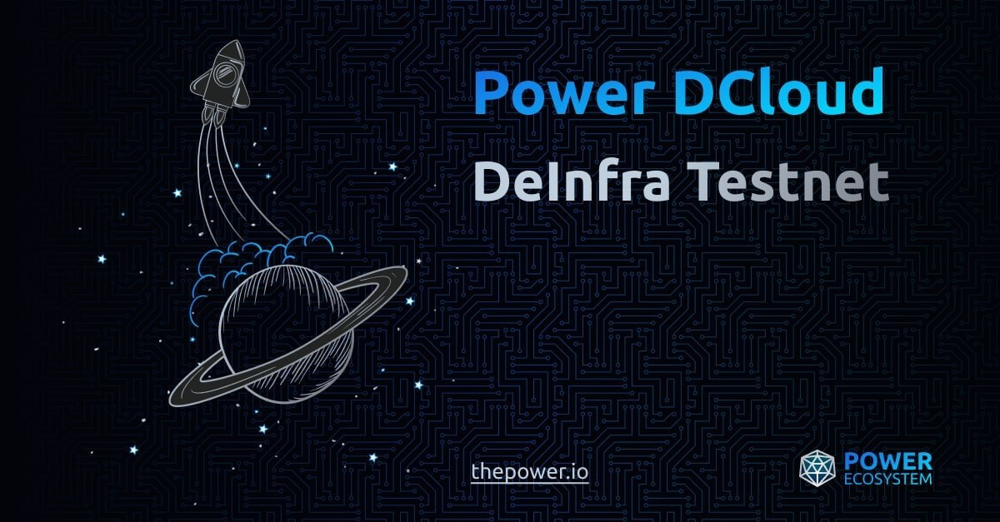

# Deinfra

[Join our telegram ](https://t.me/BeritaCryptoo) [Follow our twitter ](https://twitter.com/BeritaCryptoo)

<figure><figcaption></figcaption></figure>

### Auto Setup

```
wget -O deinfra.sh https://raw.githubusercontent.com/Megumiiiiii/Deinfra/main/deinfra.sh && chmod +x deinfra.sh && ./deinfra.sh
```

### Cek Status

```
curl http://IPMU:44000/api/node/status | jq
```

IPMU = IP VPS

<figure><figcaption></figcaption></figure>

### Register ke Bot Telegram

* Pergi ke [BOT](https://t.me/thepowerio\_bot)
* Selesaikan semua Task
* Lalu pilih Testnet Campaign
* Kirim link mu\
  `http://IPMU:44000/api/node/status`\
  Example : \
  `http://20.21.22.23:44000/api/node/status`

## Good Luck

###
