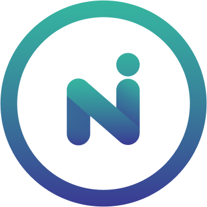

# Newrl

[Join Our Telegram](https://t.me/BeritaCryptoo)  [Follow Our Twitter](https://twitter.com/BeritaCryptoo) 

<figure><figcaption></figcaption></figure>

## Newrl Testnet Guide

****[**Official Guide**](https://docs.newrl.net/Validating/running-validator-node/)****

#### Mininum Requirements

|  Storage | RAM | CPU |
| :------: | :-: | :-: |
| 50GB SSD | 2GB |  2  |

### Setup

**Open Port**

```
sudo ufw allow ssh && sudo ufw allow 8421 && sudo ufw enable -y
```

**Update Packages**

```
sudo apt update && sudo apt upgrade -y
```

**Install Hak & Kewajiban**

```
sudo apt install -y build-essential libssl-dev libffi-dev git curl screen
```

**Install Python**

```
sudo apt install python3.9
```

**Install Pip & Python3 venv**

```
curl -sSL https://bootstrap.pypa.io/get-pip.py -o get-pip.py
python3 get-pip.py
sudo apt install python3.9-venv
sudo mkdir newrl-venv
cd newrl-venv
python3.9 -m venv newrl-venv
```

**Aktifasi**

```
source newrl-venv/bin/activate
```

**Download dan Mulai Script**

```
git clone https://github.com/newrlfoundation/newrl.git
cd newrl
scripts/install.sh testnet
```

**Buat Wallet Baru**

```
python3 scripts/show_wallet.py
```

Akan muncul info detail tentang wallet, BACKUP

> {"public": "fefcdb9c187f241ffbe76ef89ee9ff85dcd6a1ba0ad60dedaeb195d4azzzzzzzzzzzzzzzzzzzzzzzzzzzzzzzzzzzzzzzzzzzzzzzzzzzz", "private": "be46bf4f061d6a6d813005zzzzzzzzzzzzzzzzzzzzzzzzzzz", "address": "0x0000000000000000000000000000000000000DEAD"}

### Import Wallet

* Buka [Wallet Newrl](https://wallet.newrl.net/login?next=/)
* Copy output dari wallet yang tadi
* Pilih import wallet
* Paste&#x20;
* Lengkapi semua informasi yang diperlukan
* Aktifkan dan tunggu beberapa saat sampai wallenya aktif

#### Request Test Token

* Pergi ke [Faucet](https://wallet.newrl.net/faucet/)
* Masukan address dan nominal

### Jalankan Node

```
cd ~/newrl-venv/newrl
screen -S newrl
scripts/start.sh testnet
```

Untuk keluar dari sesi logs tekan `CTRL+A+D`

Untuk kembali cek logs

```
screen -Rd newrl
```

### Stake Token

* Kembali ke web wallet
* Klik garis pojok kiri
* Pilih Run a Node
* Masukan address dan jumlah token(minimal 500000)

#### Cek riwayat transaksi di browser

```
http://archive1-testnet1.newrl.net:8421/sc-state?table_name=stake_ledger&contract_address=ct1111111111111111111111111111111111111115&unique_column=wallet_address&unique_value=ADDRESSMU
```

#### Cek reward mining

```
http://144.91.99.67:8421/get-incoming-trustscores?dst_wallet_address=ADDRESSMU
```
